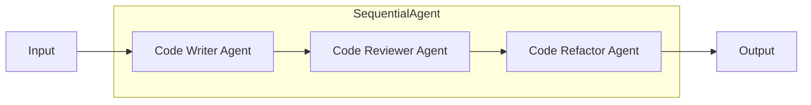

# Code Gen Agent

## Quick Links

- [Sequential agents - Agent Development Kit](https://google.github.io/adk-docs/agents/workflow-agents/sequential-agents/)

## Architecture

```mermaid
flowchart LR

Input --> sub_agents_1

subgraph SequentialAgent
    sub_agents_1 --> sub_agents_2 --> sub_agents_3
end

sub_agents_3 --> Output

%% Sub agents
sub_agents_1["Code Writer Agent"]
sub_agents_2["Code Reviewer Agent"]
sub_agents_3["Code Refactor Agent"]
```
