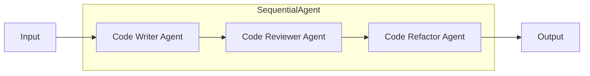

# Code Gen Agent

## Quick Links

- [Sequential agents - Agent Development Kit](https://google.github.io/adk-docs/agents/workflow-agents/sequential-agents/)

## Prerequisites

You need to meet the following requirements.

- Python 3.10+
- [Poetry](https://python-poetry.org/)

## Quick Start

At first, you need to create a `.env` file as follows:

```bash
echo -e "GOOGLE_API_KEY=<put your api key>" > src/gen_code/.env
```

## Architecture


