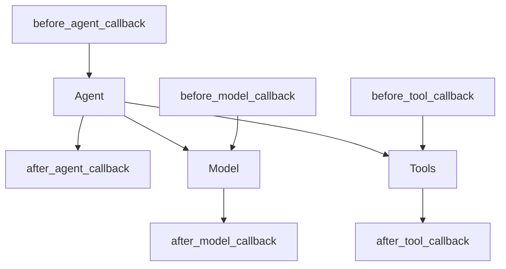

# Tech Note

## Quick Links

Callbacks

## Features

### Generate source files

After Agent Callback is one of the best practices:

cf. [Types of Callbacks](https://google.github.io/adk-docs/callbacks/types-of-callbacks/)

> **When**: Called immediately after the agent's `_run_async_impl` (or `_run_live_impl`) method successfully completes. It does not run if the agent was skipped due to before_agent_callback returning content or if end_invocation was set during the agent's run.
>
> **Purpose**: Useful for cleanup tasks, post-execution validation, logging the completion of an agent's activity, modifying final state, or augmenting/replacing the agent's final output.

### Callbacks

cf. [Callbacks: Observe, Customize, and Control Agent Behavior](https://google.github.io/adk-docs/callbacks/)

### Save Artifacts

cf. [Artifacts](https://google.github.io/adk-docs/artifacts/)
